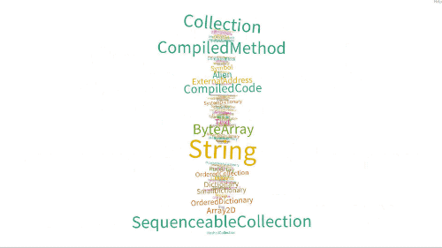

# Box2DRoassal

A [Roassal3](https://github.com/ObjectProfile/Roassal3/) Layout to distribute labels and edges in a canvas using [Box2DLiteForPharo](https://github.com/EiichiroIto/Box2DLiteForPharo).

---

One of the possibilities is this animated name cloud of classes in the hierarchy of Collection where font size is relative to number of methods defined in the class (browse methods in `RSBox2DLayoutExamples` for more information):



##  Install

Evaluate the following script in a Pharo 9 image.

```Smalltalk
Metacello new
    baseline: 'Box2DRoassal';
    repository: 'github://ObjectProfile/Box2DRoassal/src';
    load.
```

